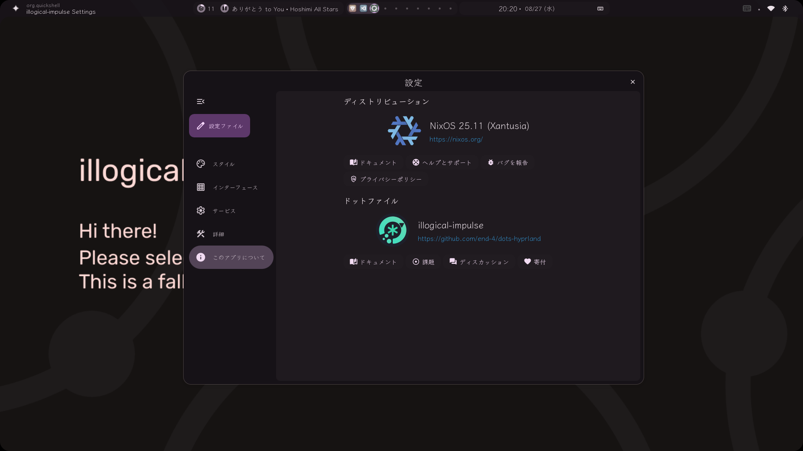

# dotfiles -- My NixOS Settings
This document is translated into English using GitHub Copilot (Claude Sonnet 4), except for the Reference section.  
この文書は、Reference以外をGithub Copilot (Claude Sonnet 4)にて英訳しています。  

- Version : Unstable
- Desktop : Hyprland + Quickshell ([end-4/dots-hyprland](https://github.com/end-4/dots-hyprland/)) / Cinnamon
- Editor : VSCode / Neovim
- Shell : Bash
- Terminal: Wezterm
- Browser : Brave

- Cinnamon is installed to Gsetting schema.

- Some scripts (especially Python) are not working due to missing required packages.

## Using illogical-impulse with NixOS(Home-manager) + Hyprland
In Home-manager, set `qt6.enable = true;`!

## Reference

- [NixOS で最強の Linux デスクトップを作ろう](https://zenn.dev/asa1984/articles/nixos-is-the-best)
- [Nix Flakeで作る開発環境管理](https://zenn.dev/stmn_inc/articles/create-environment-to-nix-flake)
- [vimjoyer/nvim-nix-video](https://github.com/vimjoyer/nvim-nix-video/tree/main)
- [redyf/nixdots](https://github.com/redyf/nixdots)
- [xBLACKICEx/end-4-dots-hyprland-nixos](https://github.com/xBLACKICEx/end-4-dots-hyprland-nixos)
- [pabloagn/rhodium](https://github.com/pabloagn/rhodium)
- [NixOS Manual (unstable)](https://nixos.org/manual/nixos/unstable/)
- [NixOS Wiki](https://wiki.nixos.org/wiki/NixOS_Wiki)
- [Appendix A. Home Manager Configuration Options](https://nix-community.github.io/home-manager/options.xhtml)
